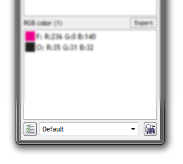

# Конвертер

Начиная с 6-й версии макроса, Конвертер внедрён в основное окно макроса (расположен внизу).

Как видно на изображении, интерфейс конвертера состоит из трёх элементов:

* Кнопка **Convert Options** — настройки Конвертера
* Выпадающий **список выбора пресетов** (заготовок настроек)
* Кнопка **Convert** — запуск Конвертера

После нажатия на кнопку **Convert** (запуск Конвертера), макрос проверит есть ли выделение в активном документе, и если таковое есть, обработает только выделенные объекты. Для того что бы обработать весь документ, включая все страницы и слои, необходимо предварительно «снять» выделение, ткнув инструментом **Pick tool** в любое свободное пространство документа. Данное поведение позволяет обрабатывать как целые документы, так и некоторые объекты выборочно.

## Принцип использования пресетов

При использовании пресетов, необходимо понимать следующее: **пресет default** — настройки которые в настоящий момент выставлены в окне настроек Конвертера. То есть, любой пресет (набор настроек) может быть пресетом default.

Выбрав какой то пресет и запустив Конвертер, вы тем самым активируете настройки из этого пресета и делаете их доступными как default. Проще говоря **пресет default — настройки которые использовались последний раз**.

## Дополнительная информация

Конвертр обрабатывает объекты в следующем порядке:

1. Symbol (символы)
2. Dimension (выносные линии)
3. PoweClip (контейнеры)
4. Effect (эффекты)
5. Text (текстовые объекты)
6. Bitmap shapes (растровые изображения)
7. Fill (заливки)
8. Outline (абрисы)
8. MeshFill (сетчатые заливки)

Графический редактор CorelDRAW имеет очень **сложную структуру** документа. Это сказывается на работе Конвертера — при слишком сложной структуре документа, иногда необходимо выполнить повторный запуск Конвертера.
