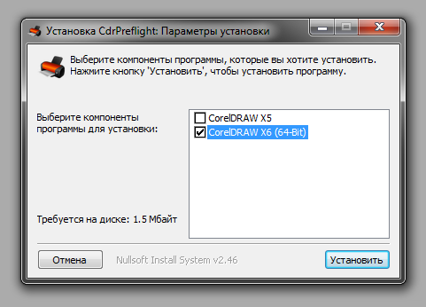
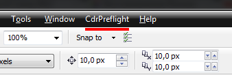
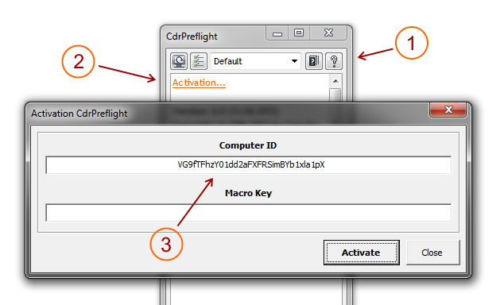
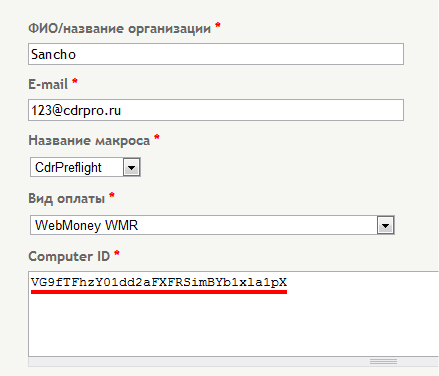

# Установка и активация

Перед покупкой полной версии макроса, необходимо установить и попробовать демо-версию.

## Установка

Примечание: если у вас установлена одна из предыдущих версий макроса, её и все связанные с ней пункты меню/кнопки, необходимо удалить.

Закройте CorelDRAW, если открыт. Затем запустите установочный файл макроса и следуйте его инструкциям. После успешной установки, необходимо запустить CorelDRAW, меню макроса, при этом, должно установиться автоматически.

## Покупка ключа

Что бы в полной мере воспользоваться всеми возможностями макроса, его нужно активировать — купить ключ. Для этого необходимо в докере демо-версии кликнуть на кнопке **About**, а затем на пункте **Activation**.... В появившемся диалоговом окне, выделить и скопировать в буфер обмена **Computer ID**.

Затем, с помощью веб-браузера, перейти на страницу покупки макроса, заполнить необходимые поля, и вставить из буфера обмена **Computer Key** в соответствующее поле формы покупки.

После отправки заказа, в течении суток (обычно быстрее), будет проверен Computer ID и если нет никаких технических проблем, на e-mail который вы указали, будут отправлены данные для оплаты и дальнейшие инструкции.

После успешной оплаты заказа (и поступления денег на счёт) вы получите ключ для активации макроса.

## Активация

Для активации откройте докер макроса, кликните на кнопке **About**, а затем на, появившемся ниже, пункте **Activation**.... Вставьте в поле **Macro Key** полученный, после оплаты, ключ и нажмите кнопку **Activate**.

После успешной активации, макрос предложит сохранить регистрационные данные в текстовый файл.
