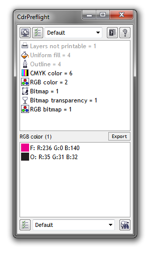
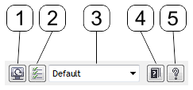
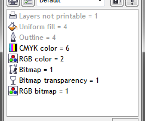
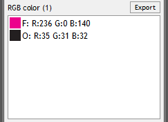

# Основное окно CdrPreflight

В 6-й версии макроса, основное окно выполнено в виде докера. Это означает, что вы можете пристыковывать его к другим докерам, находящимся справа или слева от рабочей области, или использовать отдельно, расположив в любой области окна. Так же, докер макроса можно масштабировать по ширине и высоте. Эти особенности позволяют настроить размер и положение макроса как угодно.

_Примечание: докер можно открыть выполнив команду CdrPreflight одноимённого меню._

Содержимое докера визуально можно разделить на 4 функциональные части:

1. Панель с кнопками и выпадающим списком пресетов *
2. Основная, масштабируемая область, в которой отображаются функциональные сообщения и список найденных свойств и объектов активного документа
3. Дополнительная область, в которой отображается детальная информация по каждому пункту главной области
4. Панель конвертера **

## Элементы верхней панели

1. Кнопка **Refresh Info** — получает информацию о содержимом активного документа и помещает её в основную область ниже, а так же обновляет списки пресетов
2. Кнопка **Options** — открывает окно основных настроек макроса
3. Выпадающий **список пресетов** — влияет на то, какую именно информацию макрос выводит в области ниже
4. Кнопка **Help Online** — открывает в браузере эту справку
5. Кнопка **About** — загружает информацию о макросе, программе и настройках цвета*** в основную область ниже.

## Основная область

В основной области докера, отображаются некоторые сервисные сообщения макроса, а так же общая информация о содержимом активного документа.

Для того что бы получить или обновить информацию о документе, необходимо нажать кнопку **Refresh Info**. После этого макрос проверит активный документ и в зависимости от выбранного пресета покажет найденную информацию. Ориентироваться в списке очень просто по следующим причинам:

* Информация выводится последовательно — с начала о слоях, затем об объектах, кривых, эффектах, тексте, заливках и абрисах, цветовых моделях, и в конце об растровых изображениях.
* Вывод информации фильтруется пресетами, что гарантирует, что Вы будите видеть только ту информацию, которая Вас интересует.
* Каждая строка списка, в большинстве случаев, содержит свою индивидуальную иконку, обеспечивая быстрое визуально восприятие.

Помимо иконки, каждый пункт содержит, **название параметра** и **количество найденных объектов/свойств**. Пункты, названия в которых отображаются **чёрным шрифтом**, являются активными. Кликнув по одному из таких пунктов левой кнопкой мыши, в дополнительной области ниже Вы увидите расширенную информацию. Например, кликнув по пункту **RGB color** (RGB цвета), в доп. области Вы увидите подробный список всех найденных цветов RGB. Серые пункты, коих очень мало, просто отображают информацию и не предусматривают отображение подробной информации.

Кнопка Export (Экспорт), расположенная под основной областью, отвечает за сохранение активной информации в html файл. Такой файл Вы можете отправить владельцу cdr файла, что бы указать какие именно проблемы он содержит.

## Дополнительная область

В дополнительной области, как уже было сказано выше, отображается **расширенная информация**. Над ней указана та информационная группа (пункт основной области), к которой относится информация, а в скобках указано количество объектов. Для каждой группы данных отображается своя дополнительная информация.

Для того, что бы узнать какому именно объекту (выделить его) в документе принадлежит пункт списка, достаточно кликнуть по нему левой кнопкой мыши. Если в этот момент удерживать клавишу Ctrl, макрос не только выделит объект, но и увеличит масштаб таким образом, что бы объект был хорошо виден в рабочей области. А если удерживать латинскую клавишу **А** (русская Ф), макрос выделит все объекты списка на той же странице, где расположен ключевой объект.

_* Пресет — набор настроек. Макрос CdrPreflight позволяет создавать неограниченное количество пресетов как для проверки документа, так и для его обработки._   
_** Начиная с 6-й версии, конвертр (обработчик) встроен в основное окно макроса._   
_*** Информация о настройках цвета доступна начиная только с 15 версии CorelDRAW._
